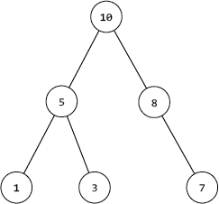
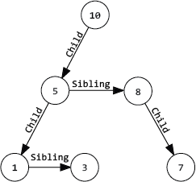

(this is not part of the license)

Project description: 

# Project 2b - Priority Queues

***Use Part A Due Date\***

## Overview

For this part of the project, you will implement your own priority queue containers. Using the interface defined in [`Eecs281PQ.h`](https://eecs281staff.github.io/p2b-priority-queues/p2b-priority-queues/Eecs281PQ.h) and the extendable test module in [`testPQ.cpp`](https://eecs281staff.github.io/p2b-priority-queues/p2b-priority-queues/testPQ.cpp), you can build and test:

- A sorted array priority queue (in [`SortedPQ.h`](https://eecs281staff.github.io/p2b-priority-queues/p2b-priority-queues/SortedPQ.h))
- A binary heap priority queue (in [`BinaryPQ.h`](https://eecs281staff.github.io/p2b-priority-queues/p2b-priority-queues/BinaryPQ.h))
- A pairing heap priority queue (in [`PairingPQ.h`](https://eecs281staff.github.io/p2b-priority-queues/p2b-priority-queues/PairingPQ.h))

Each priority queue is given in a partially complete header file and the goal is to complete the all the definitions in each file of functions that are declared in [`Eecs281PQ.h`](https://eecs281staff.github.io/p2b-priority-queues/p2b-priority-queues/Eecs281PQ.h). All of these files are included in the tarball [`p2b-priority-queues-files.tgz`](https://eecs281staff.github.io/p2b-priority-queues/p2b-priority-queues-files.tgz), and each file specifies more information about its priority queue type, including runtime requirements for each method and a general description of the container.

Also provided is a good implementation of a very bad priority queue approach called the **“Unordered priority queue”** in [`UnorderedPQ.h`](https://eecs281staff.github.io/p2b-priority-queues/p2b-priority-queues/UnorderedPQ.h), which does a linear search for the most extreme element each time it is needed. This PQ is not very efficient but it is correct, so you can test your other priority queue implementations against it to ensure that your other priority queues are returning elements in the correct order.

You are not allowed to modify [`Eecs281PQ.h`](https://eecs281staff.github.io/p2b-priority-queues/p2b-priority-queues/Eecs281PQ.h) in any way. Nor are you allowed to change the interface (names, parameters, return types) that we give you in any of the provided headers. You are allowed to add your own private helper functions and variables to the other header files as needed, so long as you still follow the requirements outlined in both the spec and the comments in the provided files.

These priority queues are templated, and can take in an optional comparison functor type, `COMP`. Inside the classes, you can access an instance of `COMP` with `this->compare()`. All of your priority queues must default to be max priority queues. This means that if you use the default comparison functor with an integer PQ, `std::less<int>`, the PQ will return the *largest* integer when you call `pq.top()`. When done correctly, the definition of most extreme is entirely dependent on the comparison functor, so if `std::greater<int>` is used, a min-PQ returning the *smallest* integer should be created.

The definition is as follows:

If `A` is any element in the priority queue, and `pq.top()` returns the “most extreme” element. `this->compare(top(), A)` should always return `false` (`A` is “less extreme” than `pq.top()`).

It might seem counterintuitive that `std::less<>` yields a max-PQ, but this is consistent with the way that the `std::priority_queue<>` works (and other STL functions that take custom comparators, like `std::sort()`).

The autograder will compile your priority queue implementations with a fresh copy of `Eecs281PQ.h` and a driver program that you will not see, to test that you have correctly and fully implemented them. To ensure that this is possible (and that you do not lose credit for these tests), do not define a main function in one of the PQ headers, or any file included in your submission.

## Eecs281PQ interface

### Member Variables

| Member Variable        | Description                                 |
| ---------------------- | ------------------------------------------- |
| `COMP_FUNCTOR compare` | `// See “Implementing the Priority Queues”` |

### Member Functions

| Member Function              | Description                                                  |
| ---------------------------- | ------------------------------------------------------------ |
| `void push(const TYPE& val)` | `// inserts a new element into the priority queue`           |
| `const TYPE &top()`          | `// returns the highest priority element in the priority queue` |
| `void pop()`                 | `// removes the highest priority element from the priority queue` |
| `size_t size()`              | `// returns the size of the priority queue`                  |
| `bool empty()`               | `// returns true if the priority queue is empty, false otherwise` |

## Unordered Priority Queue

The *unordered priority queue* implements the priority queue interface by maintaining data in an **unordered** `vector<>`. This has already been implemented for you, and you can use the code to help you understand how to use the comparison functor, etc. Complexities and details are in [`UnorderedPQ.h`](https://eecs281staff.github.io/p2b-priority-queues/p2b-priority-queues/UnorderedPQ.h) and [`UnorderedFastPQ.h`](https://eecs281staff.github.io/p2b-priority-queues/p2b-priority-queues/UnorderedFastPQ.h).

The *unordered fast priority queue* takes advantage of the fact that common priority queue usage involves a call to `.top()` followed by a call to `.pop()`. The “fast” version performs the linear search required by `.top()`, but stores the location of the most extreme element so a subsequent call to `.pop()` can access the element in constant time, if the container has not been modified in between calls.

## Sorted Priority Queue

The *sorted priority queue* implements the priority queue interface by maintaining a **sorted** `vector<>`. Complexities and details are in [`SortedPQ.h`](https://eecs281staff.github.io/p2b-priority-queues/p2b-priority-queues/SortedPQ.h). This should be written almost entirely using the STL. The number of lines of code needed to get this working is fairly low, generally �<=10.

## Binary Heap Priority Queue

Binary heaps will be covered in lecture. We also highly recommend reviewing online resources like [Binary Heap on Wikipedia](https://en.wikipedia.org/wiki/Binary_heap) or Chapter 6 of the CLRS textbook. Complexities and details are in [`BinaryPQ.h`](https://eecs281staff.github.io/p2b-priority-queues/p2b-priority-queues/BinaryPQ.h). One issue that you may encounter is that the examples and code in the slides use 1-based indexing, but your code must store the values in a vector (where indexing starts at 0). There are three possible solutions to this problem:

1. Add a “dummy” element at index 0, make sure you never allow access to it, and make sure that `.size()` and `.empty()` work properly.
2. Translate the code from 1-based to 0-based. This is the best solution but the hardest.
3. Use a function to translate indices for you. Instead of accessing `data[i]`, use `.getElement(i)`. The code for `.getElement()` is given below (both versions are needed). Notice that `.getElement()` returns a VALUE (like a `string` or object, whatever is inside the PQ), NOT an index.

.getElement() implementations

|      | // Translate 1-based indexing into a 0-based vector |
| ---- | --------------------------------------------------- |
|      | TYPE &getElement(std::size_t i) {                   |
|      | return data[i - 1];                                 |
|      | }  // getElement()                                  |
|      |                                                     |
|      | const TYPE &getElement(std::size_t i) const {       |
|      | return data[i - 1];                                 |
|      | }  // getElement()                                  |

## Pairing Heap Priority Queue

Pairing heaps are an advanced heap data structure that can be quite fast. In order to implement the pairing heap priority queue, read these two papers that describe the data structure:

1. [Fredman Paper](https://eecs281staff.github.io/p2b-priority-queues/p2b-priority-queues/pairing-heaps-fredman.pdf)
2. [Sahni Paper](https://eecs281staff.github.io/p2b-priority-queues/p2b-priority-queues/pairing-heaps-sahni.pdf)

Runtime complexity details can be found in [`PairingPQ.h`](https://eecs281staff.github.io/p2b-priority-queues/p2b-priority-queues/PairingPQ.h). Also included are a couple of diagrams that may help you understand the tree structure of the pairing heap.

Below is the pairing heap modeled as a tree, in which each node is greater than all of its children:

To implement this structure, the pairing heap will use child and sibling pointers to have a structure like this:

## Implementing the Priority Queues

Look through the included header files: you need to add code in [`SortedPQ.h`](https://eecs281staff.github.io/p2b-priority-queues/p2b-priority-queues/SortedPQ.h), [`BinaryPQ.h`](https://eecs281staff.github.io/p2b-priority-queues/p2b-priority-queues/BinaryPQ.h), and [`PairingPQ.h`](https://eecs281staff.github.io/p2b-priority-queues/p2b-priority-queues/PairingPQ.h), and this is the order that we would suggest implementing the different priority queues. Each of these files has `TODO` comments where you need to make changes. We wanted to provide you with files that would compile when you receive them, so some of the changes involve deleting and/or changing lines that were only placed there to make sure that they compile. For example, if a function was supposed to return an integer, NOT having a return statement that returns an integer would produce a compiler error. Look at [`UnorderedPQ.h`](https://eecs281staff.github.io/p2b-priority-queues/p2b-priority-queues/UnorderedPQ.h) as an example, as it’s already completed for you.

When you implement each priority queue, you cannot compare data yourself using the `<` operator. You can still use `<` for comparisons such as a vector index to the size of the vector, but you must use the provided comparator for comparing the data stored inside your priority queue. Notice that `Eecs281PQ` contains a member variable named compare of type `COMP` (one of the templated class types). Although the other classes inherit from `Eecs281PQ`, you cannot access the compare member directly, you must always use `this->compare` (this is due to a template inheriting from a template). Notice that in `UnorderedPQ` it uses `this->compare` by passing it to the `max_element()` algorithm to use for comparisons.

When you write the `SortedPQ` you cannot use `std::binary_search()` from the STL, but you wouldn’t want to: it only returns a bool to tell you if something is already in the container or not! Instead use the `std::lower_bound()` algorithm (which returns an iterator), and you can also use the `std::sort()` algorithm – you don’t have to write your own sorting function. You do however have to pass the `this->compare` functor to both `std::lower_bound()` and `std::sort()`.

The `BinaryPQ` is harder to write, and requires a more detailed and careful use of the comparison functor

## Libraries and Restrictions

For all of the priority queue implementations, you **are** allowed to use `std::swap()` and `std::size_t`, and the `std::less<TYPE>` that we specified as the default comparator. For the `SortedPQ` you can use `std::sort()` and `std::lower_bound()`. For both `SortedPQ` and `BinaryPQ`, you are allowed to use `std::vector<>`. For the `PairingPQ`, you can use `std::queue<>` and `std::deque<>`

For all of the priority queue implementations, you are **not** allowed to use `std::priority_queue<>`, `std::partition()`, `std::partition_copy()`, `std::partial_sort()`, `std::stable_partition()`, `std::make_heap()`, `std::push_heap()`, `std::pop_heap()`, `std::sort_heap()`, `std::qsort()`, or anything that trivializes the implementation of the binary heap.

You have to be a little careful with the disallowed functions, because the program that checks your code doesn’t care about comments. So if you have “sort” or “make_heap” in a comment, your code will still be flagged as possibly using one of the disallowed functions.

## Compiling and Testing Priority Queues

You are provided with a test file, [`testPQ.cpp`](https://eecs281staff.github.io/p2b-priority-queues/p2b-priority-queues/testPQ.cpp), which contains examples of unit tests you can run on your priority queues to ensure that they are correct; however, it is not a complete test of your priority queues; for example it does not test `.updatePriorities()`. It is especially lacking in testing the `PairingPQ` class, since it does not have any calls to `.addNode()` or `.updateElt()`. You should add code to this file for additional testing.

Using the 281 [`Makefile`](https://eecs281staff.github.io/p2b-priority-queues/p2b-priority-queues-Makefile), you can compile [`testPQ.cpp`](https://eecs281staff.github.io/p2b-priority-queues/p2b-priority-queues/testPQ.cpp) by simply entering:

|      | $ make testPQ |
| ---- | ------------- |
|      |               |

or

|      | $ make alltests |
| ---- | --------------- |
|      |                 |

You may use your own Makefile, but you will have to make sure it does not try to compile your driver program as well as the test program (i.e., use at your own risk).